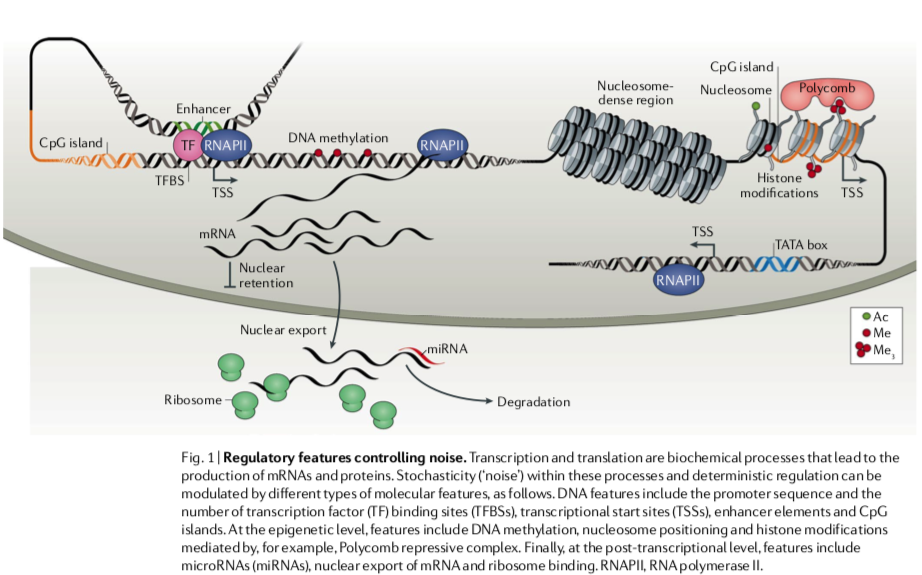
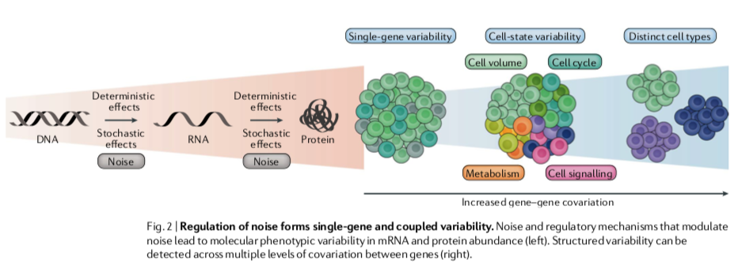

# Paper

* **Title**: Challenges in measuring and understanding biological noise
* **Authors**: Eling et al.
* **Tags**: Review
* **Year**: 2019
* **Rating**: 4/10

#### Novel Points
* The paper is a review of noise concept in biological systems.

