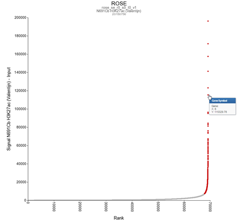

# ChipSeqAnalysis

Transcription of DNA to RNA is regulated by the Chromatine Immuno Precipitation binding of elements. 

These can be Transcription Factors, that bind temporarily to start transcription, but also chemical modification of the histones (molecular structures that coil the DNA) by methylation, acetylation, etc. 

* Some experiments can be analyzed with the MACS2 algorithm. This version can detect narrow (like transcription factors) or broad (like histone modifications).

* Yet another algorithm is RSEG; it is especially designed for histone modification detection. In R2 this used to analyse the histone modification patterns. To distinguish between specific histone modifications (e.g. acetylation vs methylation), R2 allows you to assess the same region in two profiles.

### Super-enhancers

An enhancer is a short (50-1500 bp) region of DNA that can be bound by proteins (activators) to increase the likelihood transcription will occur at a gene. They can be located up to 1 Mbp (1,000,000 bp) away from the gene, either upstream or downstream from the start site, and either in the forward or backward direction. A super-enhancer is a region of the mammalian genome comprising multiple of these enhancers, collectively bound by an array of transcription factor proteins to drive transcription of genes, often involved in regulation of cell identity. They can be up to 20 times the size of an enhancer.

For identification of super-enhancers R2 uses the Rank Ordering of Super-Enhancers algorithm (ROSE). This takes the peaks called by RSEG for acetylation and calculates the distances in-between to judge whether they can be considered super-enhancers. The ranked values can be plotted and by locating the inflection point in the resulting graph, super-enhancers can be assigned. It can also be used with the MACS calculated data. 

